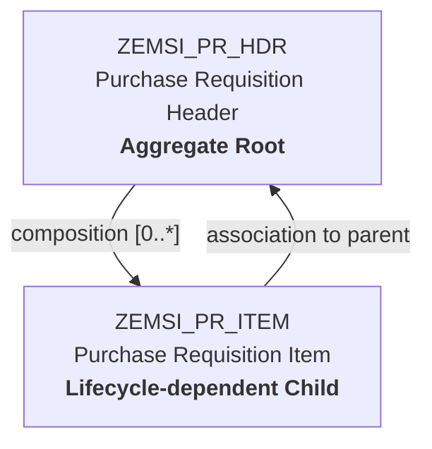
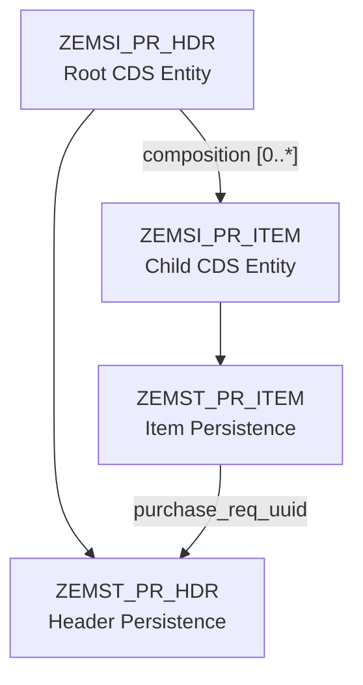

# Purchase Requisition Business Object

## Overview

The EMS Purchase Requisition is modeled as a RAP aggregate consisting of
a Header root entity and lifecycle-dependent Item entities.

## Persistence Model

## Identity Strategy

The aggregate uses technical UUIDs independently from human-readable
business identifiers.

### Header

- `PurchaseReqUuid` — technical identity
- `PurchaseReqNo` — business identifier

### Item

- `PurchaseReqItemUuid` — technical identity
- `PurchaseReqUuid` — parent technical identity
- `ItemNo` — business position inside the Purchase Requisition

Technical UUIDs are assigned early during the RAP interaction phase.

The Purchase Requisition business number is assigned later when the
document reaches the Submit stage.

See:

- ADR-002 – Primary Key Strategy
- ADR-008 – Header–Item Relationship
- ADR-009 – Composition Cardinality
- ADR-012 – Numbering Timing Strategy