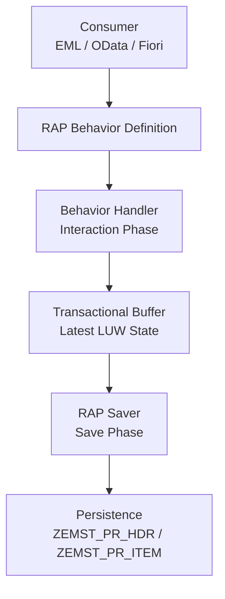
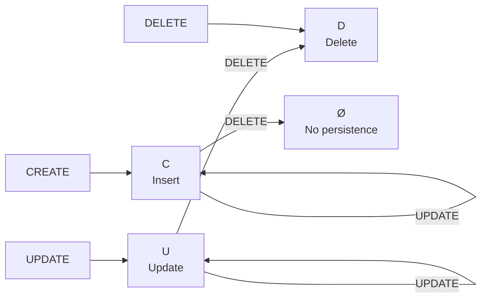
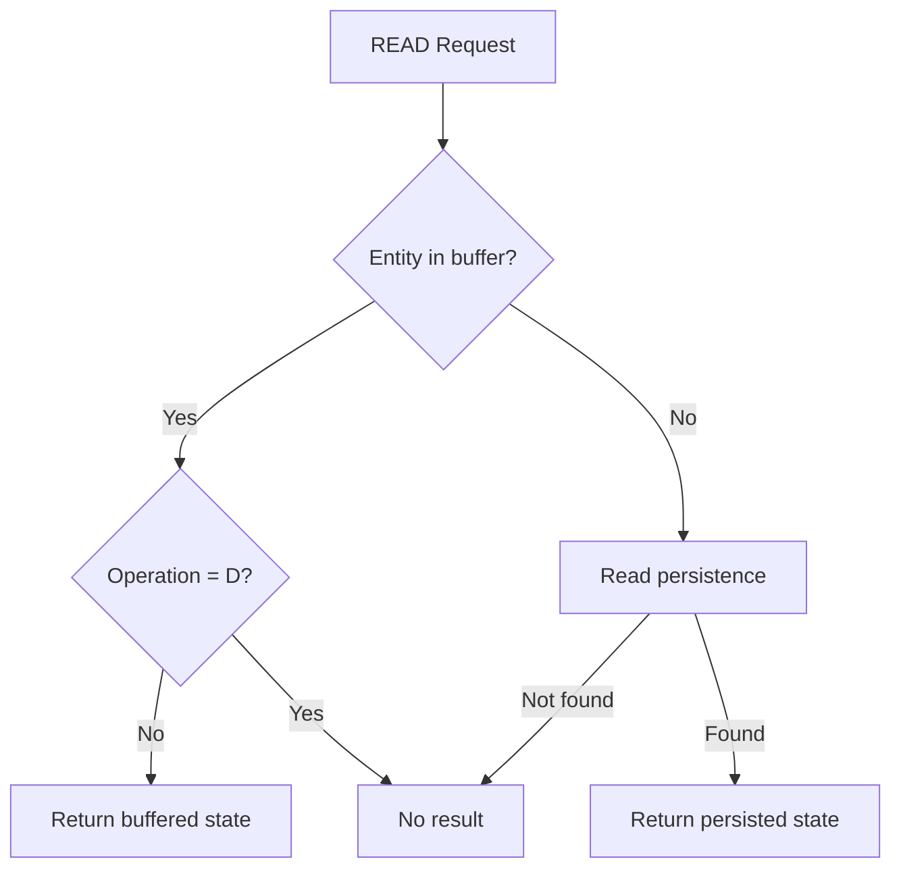
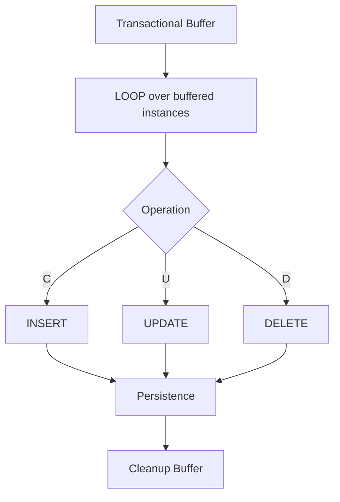
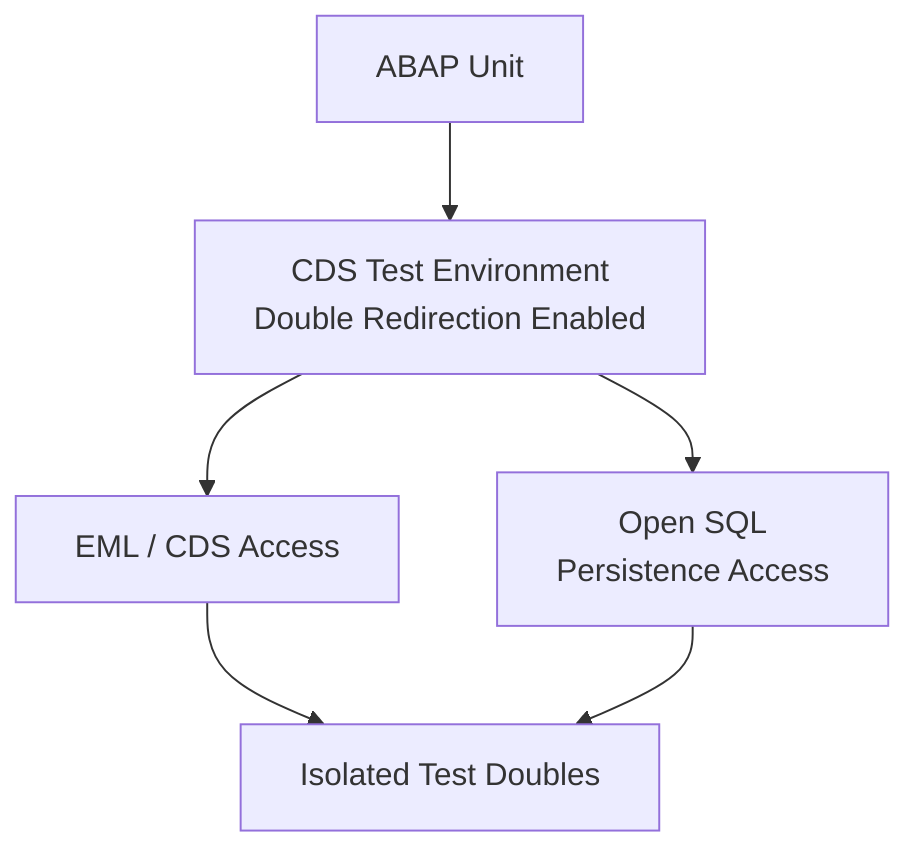

# Unmanaged RAP Transaction Lifecycle

## Overview

The EMS Purchase Requisition Business Object uses Unmanaged RAP.

The implementation separates the RAP interaction phase from database
persistence through a transactional buffer.

## Transactional State

The buffer stores the effective operation required during persistence.

## Transactional Read

The transactional buffer has priority over persisted database state.

## Save Sequence

The current implementation processes the transactional buffer using a
single loop.

## Test Architecture

The implementation is tested using ABAP Unit together with the CDS Test
Double Framework and double redirection.

This allows both RAP/EML operations and direct Open SQL access inside the
unmanaged handlers and saver to operate against the same isolated test
environment.

No productive EMS persistence data is modified by the unit tests.