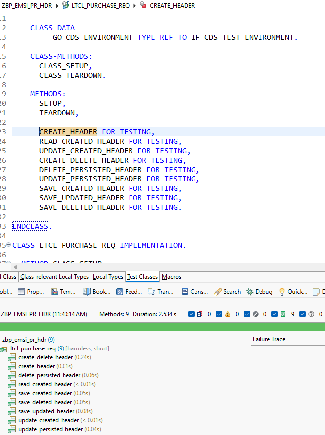

# EMS Screenshots

This directory contains sanitized screenshots that provide visual
evidence of selected EMS implementation milestones.

Screenshots are included only when they help demonstrate a technical
capability or project milestone.

Sensitive environment information such as SAP system identifiers,
hostnames, usernames, clients and transport requests must not be
included.

## Sprint 2 – Unmanaged RAP Transactional Foundation

### Purchase Requisition Header – ABAP Unit Tests

The Purchase Requisition Header transactional lifecycle is currently
covered by nine automated ABAP Unit tests.

The tests cover:

- Header creation
- Transactional reads
- Update of newly created entities
- Create followed by Delete
- Update of persisted entities
- Delete of persisted entities
- CREATE persistence during the RAP save sequence
- UPDATE persistence during the RAP save sequence
- DELETE persistence during the RAP save sequence

At this checkpoint, all nine tests pass successfully.

> The screenshot has been sanitized to remove environment-specific and
> organization-specific information.
